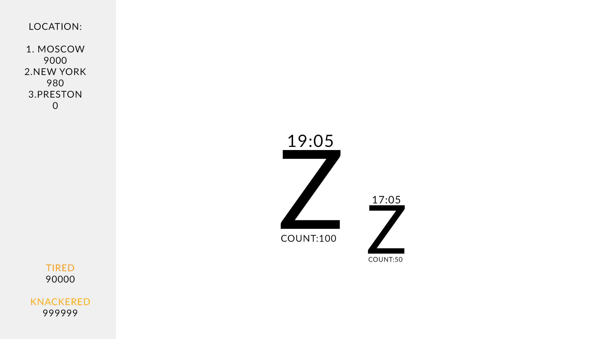
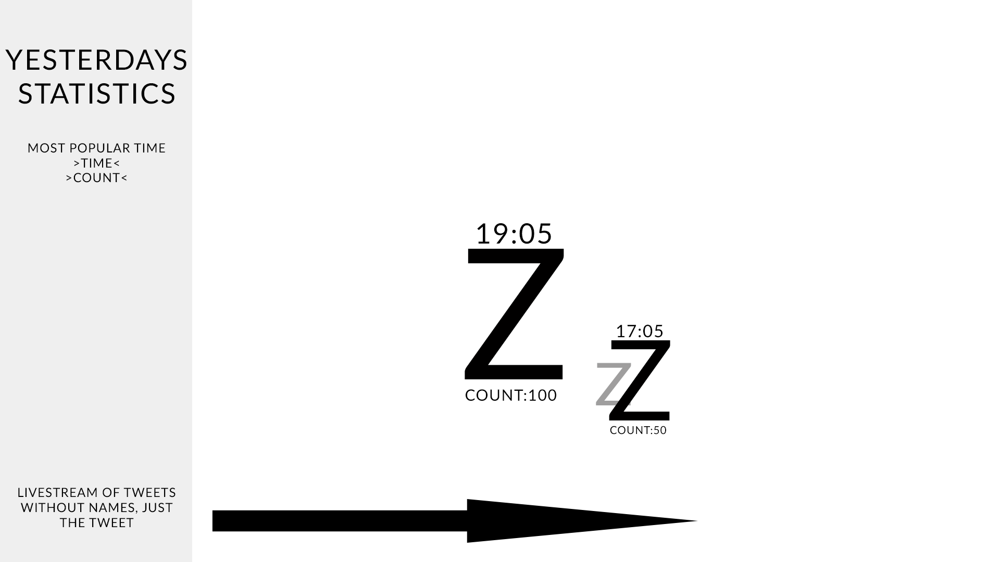
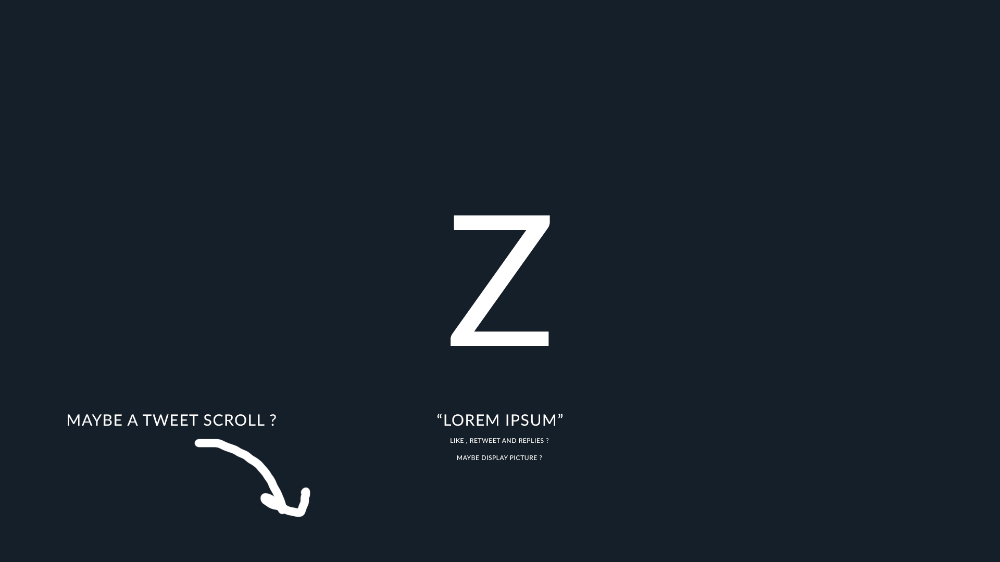
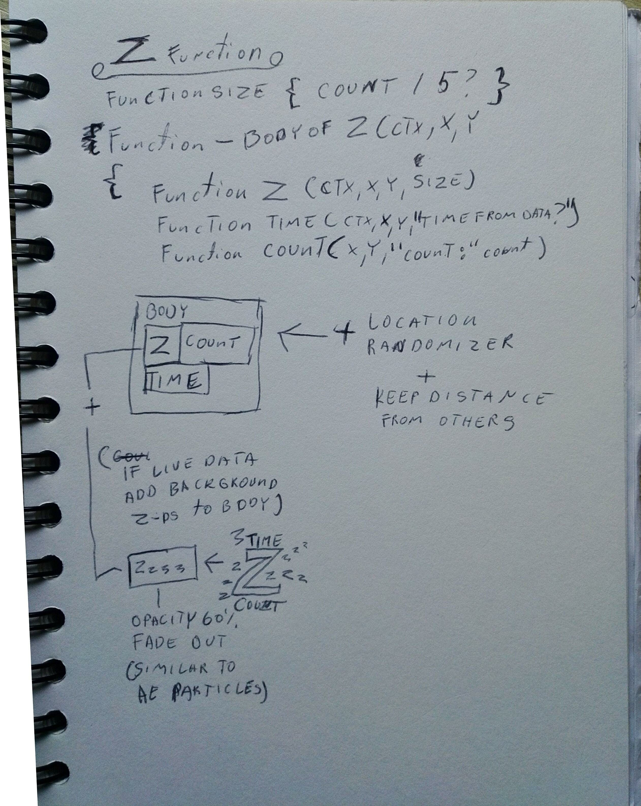

# Twitter Data Visualisation
Pulling info off Twitter with a python program possibly.

Node.js created by third years is running on a server to keep json file updated constantly whenever new tweet is tweeted.

Sleep Active Json -
http://rainerleit.eu/json/tweets.json

Awake Active Json -
http://rainerleit.eu/jsona/tweets.json

Rainer Live Example --

http://media.uclan.ac.uk/~rleit/cd/2/index.html

Emma Live Example --

> Node JS 

Node JS application under the node3 folder is run on a web server for continious data pulling.

>Color psychology

We used color psychology for the awake and sleep color choice. Blue is supposed to be calming and trustworthy while red is energetic.

## Other resources:

>Twitter API access

https://developer.twitter.com/en/docs/tweets/data-dictionary/overview/tweet-object

## Dead idea
> Idea was to store data in a database created by MongoDB and then use that data to create a animated and datadriven canvas site which ultimately was scrapped with a secondary idea due to MongoDB requiring REST API (framework) installed on the server. During testing some basic accessibility was achieved but calling information into the javascript trought the api was the problem.

## Final Idea

## Reference 
>Color Psychology

http://www.colourtheory.net/articles/colour_psychology.htm

>Node Js Application by David Warrington

https://github.com/davidwarrington/twitter-stream

>Letter particle effect in the background.

https://codepen.io/jboeijenga/pen/pveQBz

